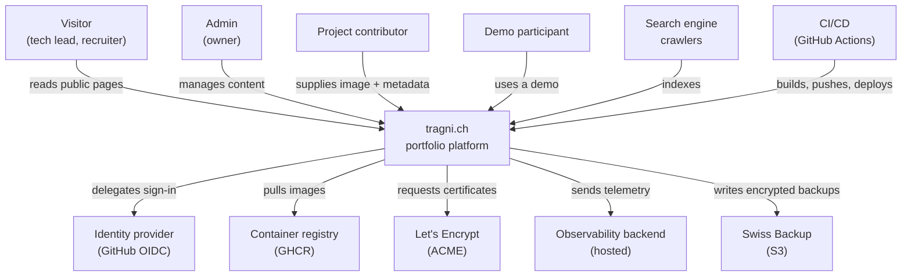

# 03 — Context and Scope

## Business context

What lies outside the system boundary, and why it is there.

### External systems

| System | Role | What crosses the boundary | If it is unavailable |
|---|---|---|---|
| **GitHub OIDC** | Identity provider | Sign-in redirect, authorisation code, external user id | Nobody can sign in. Public pages unaffected. |
| **GHCR** | Container registry | Images, by tag | Deployments fail. Running system unaffected. |
| **GitHub Actions** | Build and deploy | Source in, images out, deploy over SSH | No deployments. Running system unaffected. |
| **Let's Encrypt** | Certificates | ACME challenge and certificate | Existing certificates remain valid until expiry; renewal must succeed within that window. |
| **Observability backend** | Telemetry storage and dashboards | Traces, metrics, structured logs — **no personal data** | Blind operation. System keeps running; the collector buffers briefly, then drops. |
| **Swiss Backup (S3)** | Off-server backup | Encrypted, deduplicated snapshots | Backups fail and must be noticed. Nothing else is affected. |

Every one of these is **outbound or optional**. No external system sits in the
request path of a visitor reading a public page. That is deliberate: the part of
the system that matters for the first sixty seconds has no external dependency.

## Technical context

| Interface | Protocol | Notes |
|---|---|---|
| Visitor → platform | HTTPS (443) | Only publicly exposed port besides 80, which redirects |
| Browser → API | HTTPS, same origin (`/api`) | Same origin is a requirement, not a convenience — see [ADR-0004](../adr/0004-backend-as-authentication-authority.md) |
| API → database | PostgreSQL wire protocol | Internal Docker network only, never exposed |
| Platform → identity provider | OIDC over HTTPS | Authorisation code flow, run by the API |
| Collector → observability backend | OTLP over HTTPS | Outbound only |
| Backup job → Swiss Backup | S3 over HTTPS | Client-side encryption before upload |
| CI → server | SSH (22) | Key-only; password authentication disabled |
| Traefik → demo container | HTTP, isolated network per demo | A demo can be reached by the proxy but cannot reach the platform's network |

## Scope

What the system does and does not do is defined in
[Scope](../requirements/02-scope.md). Two boundaries matter for the
architecture:

**Demos are outside the system.** A demo is a black box that satisfies a
contract — an image in a registry, HTTP on a defined port, a health endpoint, a
routing target and resource limits. The platform does not know what runs inside
it, and a new demo requires no platform change (Q13).

**Identity is inside the system, sessions inside demos are not.** The platform
is the identity authority for all projects (A6). A demo receives user identity
only through a short-lived signed token. A demo may additionally maintain its
own transient participant identities — a room code and a nickname — which the
platform never sees or stores (A7).
