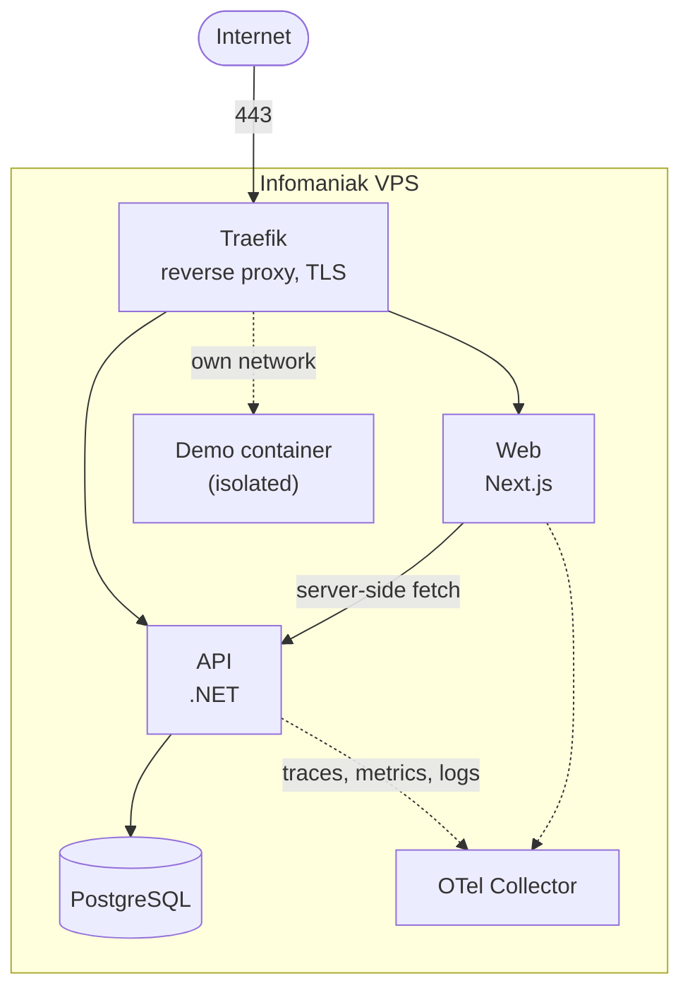
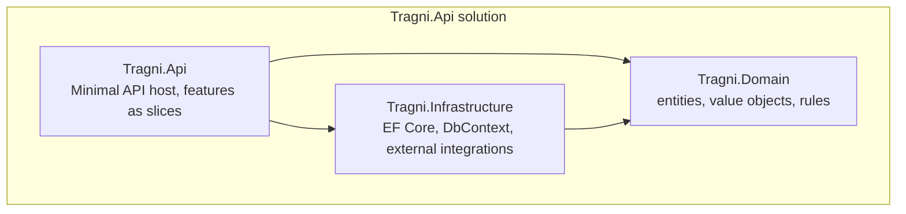
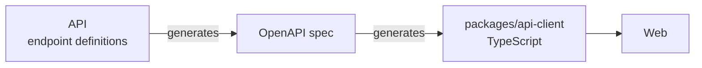

# 05 — Building Block View

## Level 1 — the system as containers



| Block | Responsibility | Does **not** |
|---|---|---|
| **Traefik** | TLS termination, routing, security headers, rate limiting | Hold application logic or state |
| **Web** | Public pages, admin interface, internationalisation | Authenticate anyone, or talk to the database |
| **API** | Business logic, persistence, authentication authority, token issuance for demos | Render HTML |
| **PostgreSQL** | All persistent platform state | Get exposed outside the internal network |
| **OTel Collector** | Receives and forwards telemetry | Store anything long-term |
| **Demo container** | One project, running | Reach the platform network or database |

The browser never calls the API cross-origin. Traefik serves both under the same
host — the web app at `/`, the API at `/api` — which is what makes the cookie
session in [ADR-0004](../adr/0004-backend-as-authentication-authority.md) work.

## Level 2 — inside the API



Dependencies point inward. **`Tragni.Domain` references nothing** — no EF Core,
no ASP.NET Core, no third-party package. That is what makes it testable without
a host and without a database, and it is the whole reason the project exists as
a separate assembly. The compiler enforces the rule; no convention is needed.

```
apps/api/
  src/
    Tragni.Domain/
      Projects/            Project, Slug, PublicationState, SlugHistoryEntry
      Media/               MediaAsset, image variant rules
      Users/               User, Role
      Common/              BaseEntity, DomainException, domain events
    Tragni.Infrastructure/
      Persistence/         AppDbContext, entity configurations, migrations
      Identity/            external provider mapping, data protection key store
      Media/               image processing, file storage
      Telemetry/           OpenTelemetry wiring
    Tragni.Api/
      Features/
        Projects/          CreateProject, PublishProject, GetProjectBySlug, ...
        Media/             UploadImage, ...
        Auth/              SignIn, SignOut, Me
        Demos/             IssueProjectToken
      Common/              endpoint filters, problem details, authorisation policies
      Program.cs
  tests/
    Tragni.Domain.Tests/           unit, no I/O, TDD
    Tragni.Api.IntegrationTests/   Testcontainers, real PostgreSQL
```

### Features as slices

One file per use case, holding the endpoint, its handler, its validator and its
request and response types. A slice is read top to bottom; a change to one use
case touches one file.

```csharp
// Features/Projects/PublishProject.cs
public static class PublishProject
{
    public sealed record Response(string Slug, DateTimeOffset PublishedAt);

    public static async Task<Results<Ok<Response>, NotFound>> Handle(
        Guid id, AppDbContext db, TimeProvider clock, CancellationToken ct)
    {
        var project = await db.Projects.FirstOrDefaultAsync(p => p.Id == id, ct);
        if (project is null) return TypedResults.NotFound();

        project.Publish(clock.GetUtcNow());       // the rule lives in the domain
        await db.SaveChangesAsync(ct);

        return TypedResults.Ok(new Response(project.Slug, project.PublishedAt!.Value));
    }
}
```

Slices may not call each other. Shared behaviour moves into the domain or into
`Common`, never sideways between features.

## Level 2 — inside the web application

```
apps/web/
  src/
    app/
      [locale]/
        (public)/          catalogue, project detail, about
        admin/             protected area, client-rendered
      api/                 route handlers (revalidation hook, health)
    features/
      catalogue/           components and data access for the public catalogue
      admin/               editor, uploads, publishing
    components/
      ui/                  base components
      layout/              header, footer, navigation
    lib/                   api client wrapper, formatting, utilities
    messages/              de.json, en.json
```

| Block | Responsibility |
|---|---|
| `app/[locale]/(public)` | Pre-rendered or incrementally regenerated pages. Must render fully without client-side JavaScript. |
| `app/[locale]/admin` | Client-rendered application against the API. SEO and static rendering are irrelevant here. |
| `features/*` | Feature-scoped components and data access; mirrors the API's slices |
| `lib/api` | Thin wrapper around the generated client. **The only place that knows the API exists.** |

## The boundary between the two applications



The generated client is the single contact point required by
[ADR-0003](../adr/0003-monorepo-over-polyrepo.md). Nothing else is shared —
no source directory, no types written twice, no runtime.

The practical consequence is the point of the whole arrangement: rename a field
in the API and the frontend build fails immediately, in the same pull request,
instead of failing in production when someone opens the page.
