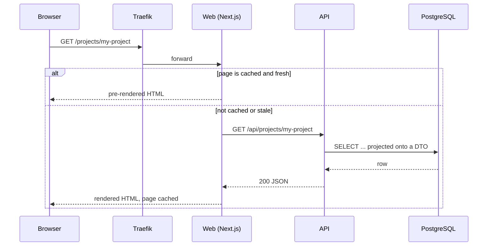
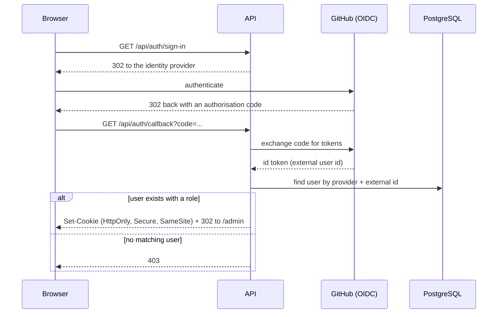
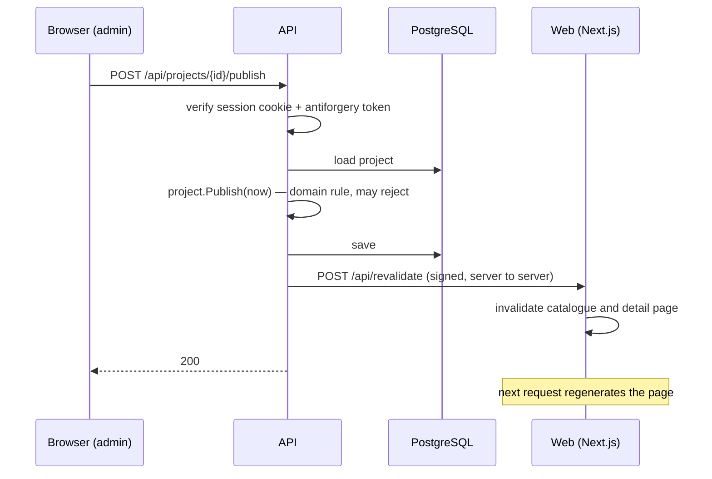
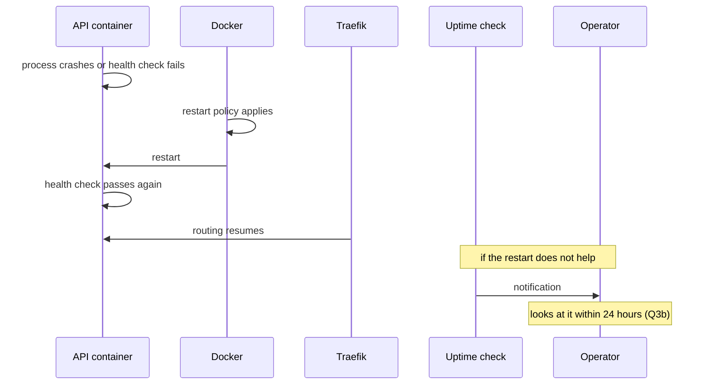

# 06 — Runtime View

Four scenarios. They were chosen because each one exercises a decision that
would otherwise only exist on paper.

## 1 — A visitor opens a project page

Covers PK-03 and the quality goals Q1 and Q4.

The fast path involves neither the API nor the database. That is what makes the
first-visit target realistic on a 2-vCPU server.

**Slug changed since the link was created:** the API finds no project for the
requested slug, looks it up in the slug history, and returns the current slug.
The web application answers with a permanent redirect. An unknown slug that is
in no history produces a 404; a retired project produces a 410.

## 2 — The admin signs in

Covers CV-01 and [ADR-0004](../adr/0004-backend-as-authentication-authority.md).

Three things this diagram makes visible:

- The web application is **not in the flow at all**. It holds no authentication
  logic, which is the entire point of the decision.
- No token ever reaches browser JavaScript. Cross-site scripting cannot steal a
  session it cannot read.
- Authorisation is a lookup against the local user table. The identity provider
  states *who* someone is; it never decides what they may do.

**The cookie is encrypted with data protection keys.** Those keys are persisted
outside the container. If they were not, every container restart — and restarts
are expected, see scenario 4 — would silently sign everyone out.

## 3 — The admin publishes a project

Covers CV-04, Q14 and the promise that publishing never requires a deployment.

The revalidation call is server-to-server and signed with a shared secret; it is
not reachable from the browser. If it fails, the change is still saved and the
page refreshes on its normal schedule — the request is an optimisation, not a
correctness requirement, and the publish endpoint does not fail because of it.

The state transition itself lives in the domain and rejects invalid publishes,
for instance a project with no summary. That rule is unit-tested without a
database.

## 4 — A container fails at three in the morning

Covers Q3c, and is the scenario the availability target actually depends on.

The design assumption is that most failures are a crashed container or a full
disk, and that both are handled without a person. Everything else waits until
the operator is available — which is why the availability target is 97 % and not
higher, and why that number is written down rather than aspired to.

**Sessions survive this** because the data protection keys are persisted.
**Data survives this** because PostgreSQL writes to a volume, not to the
container's filesystem.

## Deployment, for completeness

`main` → CI builds both images → pushes to the registry → connects over SSH →
runs the database migration as a **separate one-off step** → pulls and restarts
the containers → verifies the health endpoints.

Migrations never run at application startup. Two containers starting at the same
time would migrate concurrently, and a migration that fails at startup produces
a crash loop instead of a clear error.
