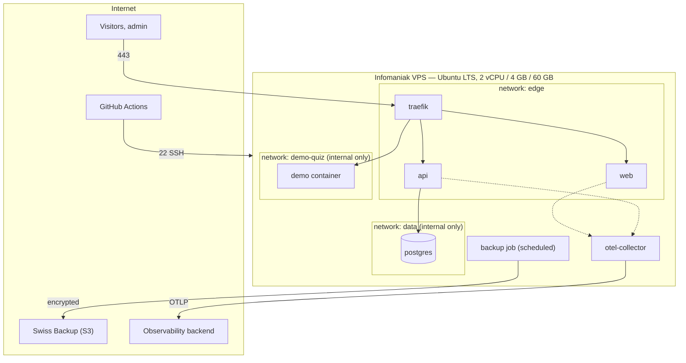
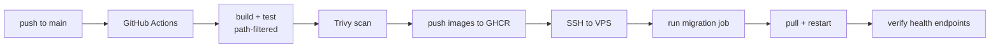

# 07 — Deployment View

## Infrastructure

One Infomaniak VPS (constraint T3), Ubuntu LTS, Docker with Compose. Nothing is
installed on the host beyond Docker itself, the SSH daemon and unattended
security upgrades.

## Networks

Network separation is the mechanism that keeps a third-party demo from becoming
a platform compromise.

| Network | Members | Reachable from |
|---|---|---|
| `edge` | traefik, web, api | Traefik is the only one bound to a host port |
| `data` | postgres, api | Nothing outside; never published to the host |
| `demo-<name>` | traefik, that one demo (and its own database, if it has one) | Traefik only |

Traefik is attached to every demo network so it can route to it. **A demo is
attached to its own network only** — it can therefore be reached by the proxy
but cannot reach the API, the platform database, or any other demo. Demos never
share a network with each other.

## Ports

| Port | Visibility | Service |
|---|---|---|
| 443 | public | Traefik — the only entry point |
| 80 | public | Traefik — redirect to 443 |
| 22 | public, key-only | SSH, for deployment |
| everything else | internal | Container ports are never published to the host |

Firewall: only 22, 80 and 443 are open. PostgreSQL is not published to the host
at all, so it is not reachable even from the host's public interface.

## Resource budget

Derived from constraint T4 and tracked as quality goal Q10.

| Component | Budget | Notes |
|---|---|---|
| Ubuntu + Docker daemon | ~450 MB | |
| Traefik | ~60 MB | |
| PostgreSQL | ~350 MB | tuned deliberately, not left at defaults |
| API | ~200 MB | workstation garbage collection, not server mode |
| Web | ~250 MB | standalone output; most pages static or regenerated |
| OTel Collector | ~80 MB | forwards only, stores nothing |
| **Base stack** | **≤ 1.5 GB** | the figure Q10 measures |
| Page cache and headroom | ~500 MB | not allocated — PostgreSQL gets slow without it |
| **Available for demos** | **~2.2 GB** | roughly three demos at 512 MB |

**Every container has an explicit memory limit.** Without one, a single runaway
process takes the host down, and on a machine with this little headroom that is
not a remote possibility. A JVM-based demo in particular will consume whatever
it can see unless it is told not to.

Swap is configured with a low swappiness value. It does not make the machine
faster; it prevents the out-of-memory killer from terminating PostgreSQL when a
spike occurs.

**Scaling trigger:** if base stack usage exceeds 75 % at p95 over two weeks, or
swap is used regularly, the server is scaled up. That is a measured decision,
not a feeling — which is why the observability in
[ADR-0006](../adr/0006-hosted-observability-backend.md) is part of the MVP and
not a later phase.

## Persistent state

| What | Where | Backed up |
|---|---|---|
| Database | Docker volume | yes — dump, then encrypted upload |
| Uploaded media | Docker volume | yes — direct encrypted upload |
| Data protection keys | Volume or database | yes — losing them signs everyone out |
| TLS certificates | Volume | no — reissued automatically |
| Configuration and secrets | `.env` on the server, outside the repository | separately, by hand; not in any automated backup |

Everything else is disposable. Rebuilding the server means: install Docker,
restore the `.env` file, restore the volumes, `docker compose up`. That path is
what the quarterly restore rehearsal (Q9) actually exercises.

## Deployment pipeline

Constraint T5 is the reason the server appears only in the last four steps: it
pulls and runs, it never builds. Migration is a separate one-off container, not
something the application does at startup.

## Environments

There is one production environment, and development happens locally with the
same Compose file and different configuration. There is deliberately **no
staging environment** — it would cost roughly the same resources as production
on a machine that has none to spare.

This is a real gap, not an omission: it is recorded as a risk in
[chapter 11](11-risks-and-technical-debt.md), and it is the reason the pipeline
gates (tests, Lighthouse, Trivy, accessibility) matter more here than they would
in a project that could verify a release somewhere first.
