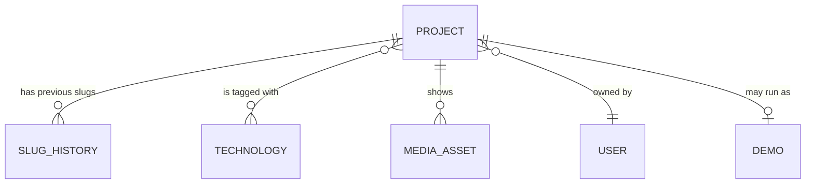

# 08 — Crosscutting Concepts

Rules that apply across all building blocks. Each exists because leaving it to
case-by-case judgement would produce inconsistency.

## Domain model



| Entity | Key points |
|---|---|
| `Project` | The central entity. Holds the publication state machine. A technical article is a project with a different type, not a second entity. |
| `Slug` | Value object. Normalises and validates on construction, so an invalid slug cannot exist. |
| `SlugHistoryEntry` | Every previous slug, with the date it was replaced. The basis for permanent redirects. |
| `Technology` | Shared taxonomy for filtering. |
| `MediaAsset` | An uploaded file plus its generated variants and mandatory alt text. |
| `User` | `Provider` + `ExternalId` + `Role`. Never a provider-specific field. |
| `Demo` | Optional. Registry image, routing target, resource limits, lifecycle state. |

**Identifiers** are UUIDv7 — time-ordered, so they index well, unlike random
UUIDs which scatter writes across the index.

**All entities carry `CreatedAt`, `UpdatedAt` and nullable `DeletedAt`.** Soft
delete is the default; a global query filter excludes deleted rows, so a
forgotten `Where` clause cannot leak them. Permanent deletion happens only
through an explicit cleanup routine.

**Publication state** is a state machine, not a boolean:

```
Draft ──publish──> Published ──retire──> Retired
  ^                    │                    │
  └────────────────────┴──── republish ─────┘
```

Transitions live on the entity and reject invalid moves. This is the primary
test-driven surface (Q6a).

## Typing and validation

TypeScript with `strict: true`, plus `noUncheckedIndexedAccess`. A lint rule
forbids `any`; where a type is genuinely unknown, `unknown` is used and narrowed.

**TypeScript types do not exist at runtime.** A response that does not match its
declared type passes the compiler and fails later somewhere unrelated. Therefore:

| Boundary | How it is validated |
|---|---|
| Form input in the browser | Zod schema, before submitting |
| API request in the backend | FluentValidation, in the slice's validator |
| API response in the frontend | the generated client's types; parsed with Zod where the shape is dynamic |
| Configuration at startup | validated on boot; the application refuses to start on a missing or malformed value |

Inside a boundary, types are trusted. At a boundary, data is checked. The API
types themselves are never written by hand — they are generated from the OpenAPI
specification ([ADR-0003](../adr/0003-monorepo-over-polyrepo.md)).

## Error handling

| Layer | Behaviour |
|---|---|
| Domain | Throws a `DomainException` for a violated rule. Rules are the domain's job, not the endpoint's. |
| Slice | Catches expected failures and returns a typed result. Unexpected exceptions are not caught. |
| API surface | Every error response is RFC 9457 Problem Details. No stack traces, no internal messages. |
| Frontend | Distinguishes expected failures (shown in place, in context) from unexpected ones (error boundary) |

Validation failures return 400 with field-level detail. Authentication failures
return 401, authorisation failures 403 — never 404 to hide the difference,
because the resulting behaviour is impossible to debug.

## Authentication and authorisation

The flow is in [chapter 6](06-runtime-view.md) and the decision in
[ADR-0004](../adr/0004-backend-as-authentication-authority.md). The rules that
apply everywhere:

- **Authorisation is expressed as policies**, never as role comparisons in code.
  `RequireAuthorization("CanManageProjects")`, not `if (user.Role == "Admin")`.
  Adding a role then changes one definition instead of every call site.
- **Endpoints are protected by default.** Public endpoints are marked
  explicitly. A forgotten attribute must fail closed, not open.
- **Ownership questions are resource-based authorisation**, through
  `IAuthorizationHandler` — "may this user edit *this* project" is a different
  question from "does this user have a role".
- **Every write request requires an antiforgery token.** Cookie authentication
  needs it; token-in-header schemes do not.
- **The session cookie is scoped tightly to the main host.** A demo subdomain
  must never receive it.

Demos receive identity only through short-lived signed tokens issued by the API
for one specific project (A6). A demo verifies the signature and nothing else —
it holds no credentials, and it has no database access.

## Media and images

Uploads are validated by **actual content**, not by file extension. Variants in
modern formats and several widths are generated at upload time, not on request —
a 2-vCPU server should not resize an image while someone is waiting.

Alt text is a mandatory field at upload (Q5). Making it optional means it will
be omitted, and accessibility becomes a retrofit rather than a property.

Files live in a Docker volume and are served through the proxy with long cache
lifetimes and content-hashed names. Unreferenced assets are removed by a cleanup
routine.

## Internationalisation

German and English, with the locale in the route (`/de/...`, `/en/...`) so each
language is a distinct, indexable URL with the correct `hreflang`.

Only the interface and content are translated. **Slugs are not localised** — one
project has one slug, in one language. Localised slugs would multiply the slug
history and the redirect logic for no benefit at this size.

Dates, numbers and relative times are formatted through the platform's
internationalisation APIs, never by string concatenation.

## Logging and telemetry

Structured logging throughout — no interpolated message strings. Every log entry
carries a trace identifier, so a log line and a request can be connected.

**Never logged or sent as telemetry:** request bodies, cookie or authorisation
headers, email addresses, full IP addresses, anything a user typed. This is
checked when instrumentation is written, not afterwards
([ADR-0006](../adr/0006-hosted-observability-backend.md)).

| Level | Used for |
|---|---|
| Error | Something failed and needs attention |
| Warning | Something recovered, but repeated occurrences matter |
| Information | Business events — published, uploaded, signed in |
| Debug | Local development only |

Health endpoints distinguish **liveness** from **readiness**:

| Endpoint | Question | Checks | Used by |
|---|---|---|---|
| `/health/live` | Is the process alive? | none, deliberately | Docker restart policy |
| `/health/ready` | Can it serve requests? | every check tagged `ready` — the database, once it exists | proxy, deployment check |

Liveness runs no checks on purpose. If it checked the database, a database
outage would make Docker restart a healthy API in a loop — which fixes nothing
and adds load while the database recovers.

## Configuration and secrets

Configuration comes from the environment, never from a committed file. The
application validates its configuration at startup and refuses to run with a
missing value, rather than failing later with a null reference.

| Where | What |
|---|---|
| `.env.example` in the repository | every variable, with placeholders and a comment |
| `.env` on the server | the real values, outside the repository, restricted permissions |
| GitHub secrets | what the pipeline needs — SSH key, registry token |

A secret that has been pushed is compromised and must be rotated, not removed
(constraint T6).

## Database and migrations

Migrations are generated from the model, reviewed like code, and **never run at
application startup** — they are a separate step in the pipeline
([chapter 7](07-deployment-view.md)).

Read paths use `AsNoTracking()` and project directly onto DTOs. Loading full
entities to map them afterwards fetches columns — the whole Markdown body of
every project, for a list view — only to discard them.

Every foreign key and every column used in a filter is indexed deliberately.
`Slug` is unique; the slug history is indexed on the old slug, because that is
the lookup that serves redirects.

## Testing

| Level | Tool | Against |
|---|---|---|
| Domain unit tests | xUnit v3 | no I/O, no framework — the TDD surface |
| Integration tests | xUnit v3, `WebApplicationFactory`, Testcontainers | the API in-process, real PostgreSQL in a container |
| Frontend unit tests | Vitest | logic and hooks |
| Component tests | Testing Library | rendered output and behaviour |
| End-to-end | Playwright | the whole stack, including axe-core checks |
| Mutation testing | Stryker.NET | the domain layer only |

In-memory database providers are deliberately not used: they accept queries real
PostgreSQL rejects, so a green test says nothing about production.

.NET tests run on Microsoft Testing Platform, opted in via `global.json`.

## Accessibility and SEO

Semantic HTML before ARIA. Keyboard reachability for everything interactive.
Visible focus. Contrast checked, not assumed.

Public pages must render fully without client-side JavaScript — which serves
crawlers and users on poor connections by the same mechanism, and is the reason
filtering is expressed as links rather than buttons (PK-02).

Every public page carries metadata, Open Graph tags and structured data.
`sitemap.xml` is generated from published projects, so it cannot drift.
