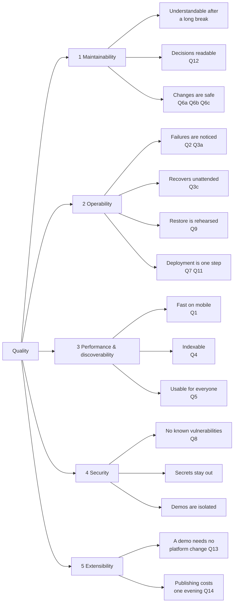

# 10 — Quality Requirements

The measurable requirements with their metrics, verification methods and gates
are in [Quality goals](../requirements/03-quality-goals.md) and are not repeated
here. This chapter adds the tree and the scenarios — what the numbers mean in
terms of behaviour.

## Quality tree

## Scenarios

Written as stimulus and expected response, so they can be checked rather than
argued about.

### Maintainability

| Stimulus | Expected response |
|---|---|
| The owner returns after three months and wants to add a feature | Reads the README and the relevant ADR, and is productive within one evening without asking anyone |
| An outside developer wants to know why there is no mediator | Finds [ADR-0008](../adr/0008-no-mediator-framework.md), including the rejected alternative |
| A publication rule changes | One domain file and its tests change; no slice is touched |
| A field is renamed in the API | The frontend build fails in the same pull request, not in production |

### Operability

| Stimulus | Expected response |
|---|---|
| The API container crashes at 03:00 | Docker restarts it; service resumes without a person; the event is visible in telemetry the next morning |
| A demo consumes all available memory | Its memory limit terminates it; the platform keeps running |
| The database volume is lost | Restored from the off-server backup within 30 minutes, with at most 24 hours of data lost (Q9) |
| A deployment produces a broken image | The health check fails, the deployment is reported as failed, and the previous image is still running |
| The observability backend is unreachable | The platform keeps serving; telemetry is buffered briefly, then dropped; nothing else degrades |

### Performance and discoverability

| Stimulus | Expected response |
|---|---|
| A recruiter opens the catalogue on a phone over 4G | Largest contentful paint below 2.0 s (Q1) |
| A crawler indexes a project page | Full content in the HTML, with metadata and structured data, without executing JavaScript |
| A visitor has JavaScript disabled and filters by technology | Filtering works, because it is expressed as links (PK-02) |
| A project link is pasted into a chat | A preview card with title, description and image (PK-05) |

### Security

| Stimulus | Expected response |
|---|---|
| A cross-site scripting payload reaches a Markdown field | Sanitised on render; no script executes (CV-06) |
| Someone tries to reach `/admin` without a session | Redirected to sign-in; the API returns 401 for the underlying calls |
| A signed-in user opens a demo on a subdomain | The demo receives no session cookie; identity only via a short-lived signed token |
| A dependency with a critical vulnerability is added | The Trivy gate fails the pull request (Q8) |

### Extensibility

| Stimulus | Expected response |
|---|---|
| A contributor supplies an image and metadata for a demo | The demo runs, routed and isolated, with no change to platform code (Q13) |
| The owner has finished a new project on a weekday evening | It is written, illustrated and published in that evening, without a deployment (Q14) |
| A second identity provider becomes necessary | Configuration, not a data migration — identity is `Provider` + `ExternalId` |

## On the numbers

Two of the targets are deliberately unambitious, and both are argued in full in
the quality goals document.

**97 % availability** is what a single VPS with no redundancy and a 24-hour
response time can actually deliver. A higher figure would be contradicted by the
public status page, which is worse than a modest figure that holds.

**80–90 % coverage** is a floor that catches an untested module, not a measure of
test quality. Mutation score (Q6b) is the measure that says something.
